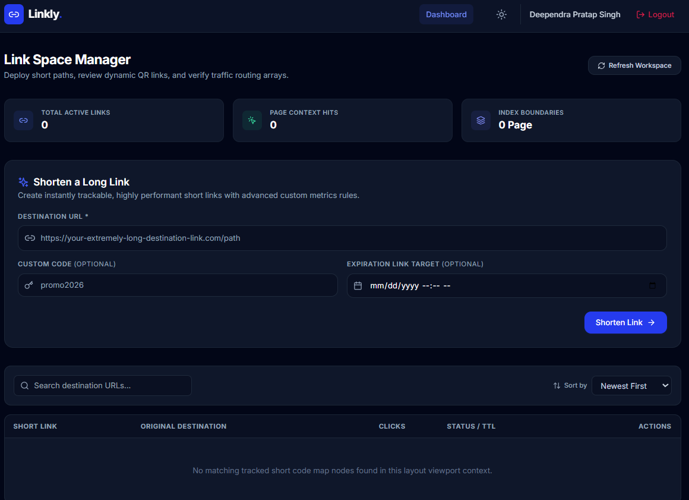

# 🔗 Linkly - Advanced URL Shortener & Analytics Platform

Linkly is a modern, full-stack web application designed to compress long URLs, generate dynamic standalone QR codes, and capture deep routing telemetry metrics. It features a fast Express/Node.js backend powered by MongoDB Atlas, alongside a highly responsive React client built using Vite, Tailwind CSS, and Recharts.

---

## 📸 Preview



---

## ✨ Features

* **Secure Authentication**: JWT-based login and user registration boundaries with automatic route guarding.
* **Custom Slugs**: Create clean, personalized short links or generate random, secure short codes automatically.
* **Dynamic QR Codes**: Instant standalone QR code generation for every deployment with copy-to-clipboard functionality.
* **Deep Telemetry Analytics**: Live telemetry loop tracking clicks over time, geographic origin coordinates, device types, browser platforms, and inbound traffic referrers.
* **System Controls**: Built-in sliding rate limits to defend against DDoS vectors, plus manual link lifecycle expiry configuration (TTL).
* **Responsive Dark Mode Toggle**: Adaptive theme context state engine utilizing Tailwind variables.

---

## 🛠️ Technology Stack

### Backend
* **Runtime**: Node.js & Express.js
* **Database**: MongoDB Atlas via Mongoose ODM
* **Security**: JSON Web Tokens (JWT), Bcrypt.js password hashing, and custom sliding rate-limiting middleware.
* **Telemetry**: Custom User-Agent header parser and anonymized cryptographic network tracking array mapping.

### Frontend
* **Framework**: React (Vite development ecosystem)
* **Styling**: Tailwind CSS & PostCSS configuration engine
* **Data Visualization**: Recharts (interactive timeline areas, responsive pie charts, and horizontal bars)
* **Icons**: Lucide React

---

## 📁 System Architecture

```text
├── backend/
│   ├── config/          # db.js, geoip.js
│   ├── controllers/     # authController.js, urlController.js, analyticsController.js
│   ├── middleware/      # authMiddleware.js, errorMiddleware.js, rateLimiter.js
│   ├── models/          # User.js, ShortURL.js, Analytics.js
│   ├── routes/          # authRoutes.js, urlRoutes.js, analyticsRoutes.js
│   ├── .env.example
│   └── server.js
└── frontend/
    ├── src/
    │   ├── components/  # Navbar, ProtectedRoute, CreateUrlForm, UrlTable, AnalyticsCards
    │   ├── context/     # ThemeContext
    │   ├── pages/       # Login, Register, Dashboard, AnalyticsDashboard
    │   ├── services/    # api.js
    │   └── App.jsx
    ├── postcss.config.js
    ├── tailwind.config.js
    └── vite.config.js
